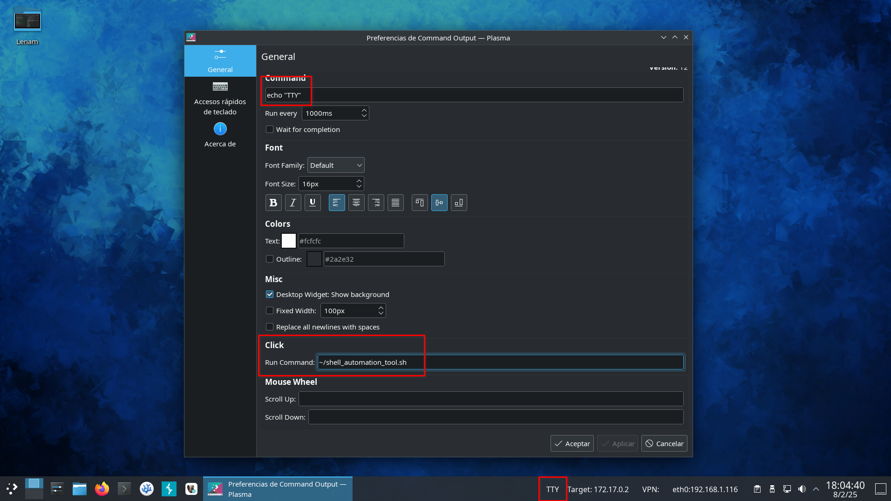

# Herramienta de Automatización de Shell

Esta herramienta está diseñada para automatizar el tratamiento de TTY cuando se crean shells en el contexto del hacking ético. Utiliza `bash` y `xdotool` para la automatización.

## Instalación
Para usar esta herramienta, necesitas tener los siguientes paquetes instalados:

- bash
- xdotool
  
Puedes instalar xdotool en Ubuntu/Debian con:

```bash
sudo apt-get install xdotool
```

En Fedora/CentOS, utiliza:

```bash
sudo dnf install xdotool
```

## Uso

Para ejecutar la herramienta, puede especificar opcionalmente dos argumentos:

1. El primer argumento (opcional) es la tecnología a utilizar para crear el shell. Por defecto, se utiliza `script`. Las tecnologías admitidas son: `script`, `php`, `python`, `perl`, y `ruby`. Si desea usar otra tecnología, modifique el script adecuadamente.
2. El segundo argumento (opcional) es el retraso en segundos después de cada comando enviado. Por defecto, la herramienta utiliza un retraso de 0.5 segundos.

Para ejecutar la herramienta, simplemente ejecute el script con los argumentos deseados:

```bash
./shell_automation_tool [TECHNOLOGY] [DELAY]
```

Ejemplo:

```bash
./shell_automation_tool.sh script 0.5
```

O

```bash
./shell_automation_tool.sh
```

## Funcionalidad

Al ejecutar `shell_automation_tool.sh` sucederá lo siguiente:

1. La flecha del cursor del ratón se modificará por otro, el usuario debe seleccionar la ventana de su shell a tratar.
2. El programa se encargara de ejecutar todos los comandos para tratar el shell (incluido el Ctrl+Z), utilizando `script` por defecto o la tecnología que se le paso como primer parámetro.

Atención: El programa escribe los comandos con un delay (configurable en el segundo parámetro), espera a que termine! Si pulsas en otra ventana que no es el shell a tratar el programa empezará a introducir los comandos en la ventana equivocada.

Una forma muy ágil de utilizar la herramienta, es poniendo la ejecución en un botón de la barra de tareas, ejemplo con Kali/KDE y el widget "Command Output" de Plasma.



A continuación un video de ejemplo del funcionamiento, **tratamiento del TTY a dos clicks**.


## Mejoras Futuras

- Actualmente siempre busca en /bin/bash en el servidor, poder indicar otros paths de búsqueda de diferentes shells que pueda tener instalados el servidor.
- Añadir las rows y columns al TTY, para tener un tratamiento total. Se me ocurren varias opciones: Pasar el cols y rows por parámetro o abrir un terminal vacío para obtenerlos y no preguntar al usuario.
- ...
